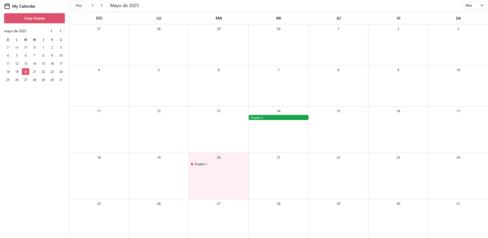

# 📅 My Calendar

**My Calendar** es una aplicación web de calendario dinámico que permite visualizar, gestionar y organizar eventos fácilmente. 

## 🚀 Características Principales

- 📆 **Vistas múltiples**: mensual, semanal y diaria para una mejor organización.
- 🔄 **Navegación sencilla** entre fechas con controles intuitivos.
- ✏️ **Gestión de eventos**: crea, edita y elimina eventos con facilidad.
- ✅ **Validación de formularios** para asegurar datos correctos y coherentes.
- ⏰ **Soporte para eventos de todo el día**, además de franjas horarias específicas.
- 💬 **Diálogos animados y notificaciones** para mejorar la interacción del usuario.
- 🗂️ **Minicalendario** para selección rápida de fechas.
- 📱 **Diseño responsive** que se adapta a cualquier dispositivo.
- 📑 **Barra lateral móvil optimizada** para una experiencia clara y accesible.

## 🛠️ Tecnologías Utilizadas

- HTML5 + CSS3
- JavaScript (modular)
- LocalStorage para persistencia de eventos
- Animaciones con CSS y JavaScript
